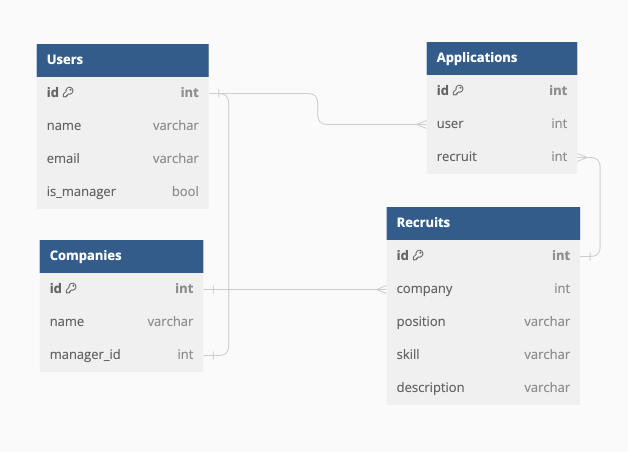

# Wanted Pre-Onboarding Backend
---

## 1. Stack
---
- __Django__ , __Django Rest Framework__ , __Sqlite__

## 2. 모델 구성
---

- Users : 사용자 모델이며, Django User를 기반으로 회사 관리자 여부 파악(is_manager)합니다.
- Companies : 회사 모델이며, User.id와 1:1 구성으로 회사와 회사 관리자를 연결합니다. 
- Recruits : 채용 공고 모델이며, company와 1:N 구성합니다.
- Applications : 지원 내역 모델이며, user.id, recruit.id로 구성하고 (user.id, recruit.id)를 unique로 구성합니다.

## 3. API
---
| url | methods | descriptions |
|---|:---|:---|
| `/recruits/?skill=&position=`| GET, POST | 채용 공고를 조회하고 추가합니다.  |
| `/recruits/<id>`| GET, PUT, DELETE | 채용 공고 상세 조회합니다. |
| `/recruits/<id>/application/`| POST | 채용 공고에 지원합니다. |

## 4. 요구사항 별 구현
---
### 채용공고 등록
- format : { "title" : "", "skill" : "", "position" : "", "description" : "" }
- 회사 관리자로 등록된 사용자로 인증(authentication)후 /recruits/ 의 Post method로 동작합니다.
- permission class를 통해 user(회사 관리자)를 확인하고, serializer를 통해 request user의 company를 사용합니다.

### 채용공고 수정
- format : { "title" : "", "skill" : "", "position" : "", "description" : "" }
- 회사 관리자로 등록된 사용자로 인증후 /recruits/<id>/ 의 Put method로 동작합니다.
- permission class를 통해 user가 해당 채용공고의 관리자 인지 확인합니다.

### 채용공고 삭제
- 회사 관리자로 등록된 사용자로 인증후 /recruits/<id>/ 의 Delete method로 동작합니다.
- permission class를 통해 user가 해당 채용공고의 관리자 인지 확인합니다.

### 채용공고 목록
- format : { "count" : n, ..., "results" : [{"pk": n, "title" : "", "company" : "", "skill" : "", "position" : "", }]}
- 모든 user에 대하여 접근가능하며, pagination을 사용하고, recruit의 list 표현에 대한 Serializer를 구현합니다.
- __검색 기능__ : querystring에서 skill, position에 대한 내용을 포함하는 filter를 처리하여 list합니다.

### 채용공고 상세 
- format : {"title" : "", "skill" : "", "company" : "", ..., "description" : "other_recruits" : [], }
- 모든 user에 대하여 접근가능하며, /recruits/<id>/ 의 Get method로 동작합니다.
- 상세 데이터를 포함하며, __해당 회사가 올린 다른 채용공고__ 는 serializer의 MethodField를 통해서 해당 채용 공고 회사와 같은 채용 공고를 제공합니다.

### 채용공고 지원
- format : {}
- 인증된 일반 User에 대하여, /recruits/<id>/application/ 의 Post method로 동작합니다.
- permission class를 통해서 인증되지 않은 사용자(anonymous) 또는 회사 관리자를 제외한 일반 사용자에 대한 권한을 갖습니다.
- User 및 recruit의 경우 request의 정보를 바탕으로 정해집니다.

## 5. 테스트
---
recruits 어플리케이션 하위의 tests 에 model, api에 대한 테스트를 작성하였습니다.
